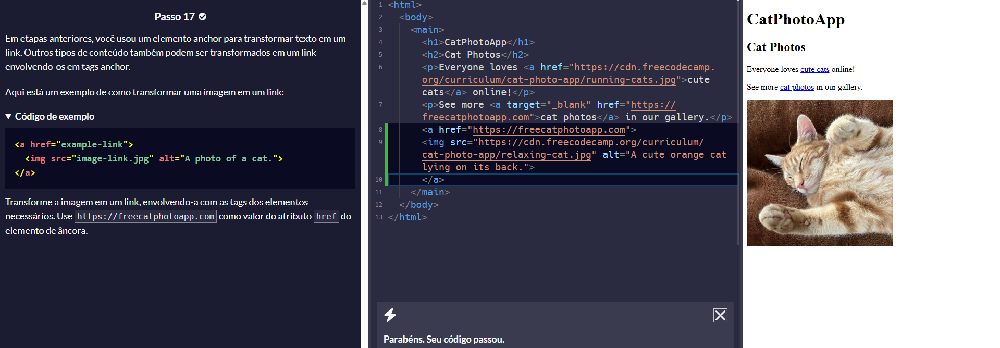
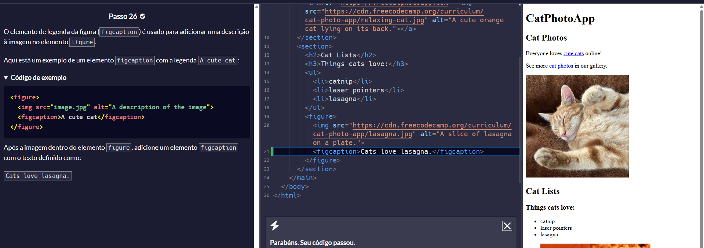
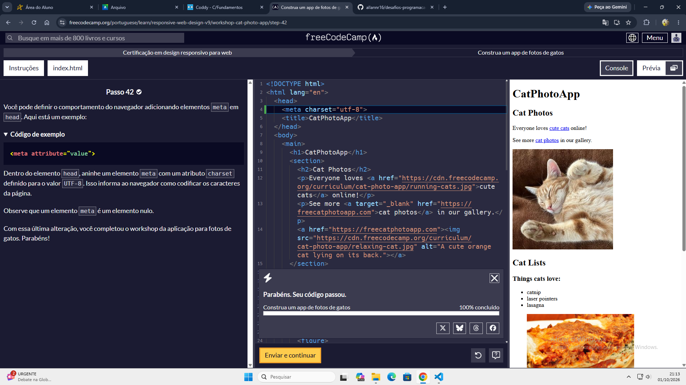

# Resolução de Desafios Práticos
* **Estudante:** Allan Navarro Rego
* **Plataforma Utilizada:** Coddy / freeCodeCamp
* **Tecnologia Praticada:** Linguagem C / HTML
* **Disciplina:** Design Profissional
---
## Tabela de Exercícios e Comprovações
| Nº | Nome do Desafio / Lição | Breve Explicação | Status na Plataforma
| Imagem Comprobatória |

| :---: | :--- | :--- | :---: | :---: |

| 01 | capítulo 1 Coddy | Uso de printf/ variveis int / float / double / char | Aprovado |  |

| 02 | imagens em link  | utilizando uma âncora junto com "img" transformo uma imagem em link 
| Aprovado |  |

| 03 | adicionando legnda na imagem  | utilizando a tag `FIGCAPTON` dentro de uma tag `FIGURE` criamos uma lengenda para a imagem
| Aprovado |  |

| 04 | pagina com fotos de gatos finalizada | utilizando os comando dentro do HTML foi criado um site com imagens, links, listas ordenadas e não ordenadas.
| Aprovado |  |

---

## Resumo dos Conceitos Praticados

foi desenvolvido comandos basicos de HTML5 mostrando como funciona a estrutura do código / comandos basicos da linguagem C 
* Quais foram as principais dificuldades?

Enteder as estruturas do código de ambas as linguagens de programação e compreender o que cada tag e comando realiza.

* Quais estruturas foram mais utilizadas? 
 
`int, float, double, char`

`<a>  <section> <footer>` 